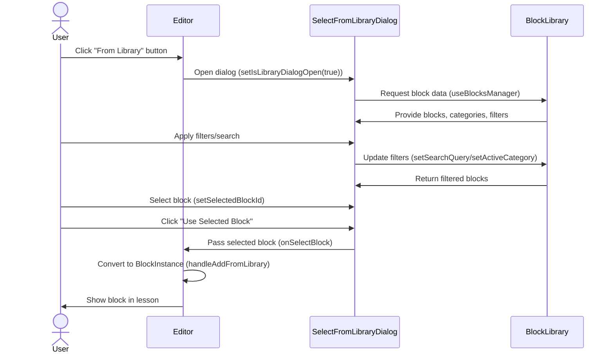

# Block Library ↔ Editor Integration

This document explains the design and implementation of the integration between the Block Library and the Editor in the MathBlocks Editor system.

## Overview

The Block Library ↔ Editor Integration enables users to reuse preconfigured blocks across multiple lessons, significantly enhancing productivity and consistency. This integration connects two major subsystems:

1. **Block Library**: A repository of saved, configured blocks that users can browse, filter, and search
2. **Creation Editor**: The main lesson creation interface where blocks are assembled into lessons

## Key Components

### 1. SelectFromLibraryDialog Component

Located at `src/components/blocks/dialogs/SelectFromLibraryDialog.tsx`, this is the primary UI for the integration:

```typescript
// Client component for interactive selection
'use client';

import React, { useState, useEffect } from 'react';
import { UIBlock } from '@/types/block-types';
// ... other imports

interface SelectFromLibraryDialogProps {
  open: boolean;
  onOpenChange: (open: boolean) => void;
  onSelectBlock: (block: UIBlock) => void;
}

export const SelectFromLibraryDialog: React.FC<SelectFromLibraryDialogProps> = ({
  open,
  onOpenChange,
  onSelectBlock
}) => {
  // Integration with block management system
  const {
    filteredBlocks,
    searchQuery,
    activeCategory,
    setSearchQuery,
    setActiveCategory,
    categories
  } = useBlocksManager();

  // Dialog-specific state
  const [selectedBlockId, setSelectedBlockId] = useState<string | null>(null);

  // ... implementation details
}
```

Key features:
- Modal dialog for browsing the block library
- Search and filtering capabilities
- Block selection and preview
- Seamless handoff to the editor

### 2. Editor Integration Points

The Creation Editor component (`src/components/editor/creation-editor.tsx`) has been extended with:

1. A "From Library" button alongside the existing "Create Block" button
2. A handler function for processing selected blocks
3. Type conversion logic to transform library blocks to editor blocks

```typescript
// In creation-editor.tsx

// State for library dialog
const [isLibraryDialogOpen, setIsLibraryDialogOpen] = useState<boolean>(false);

// Handler for adding a block from the library
const handleAddFromLibrary = (block: UIBlock) => {
  // Convert UIBlock to BlockInstance
  const newBlock: BlockInstance = {
    id: `block-${Date.now()}-${Math.random().toString(36).substr(2, 9)}`,
    type: block.type,
    parameters: { ...block.parameters },
    title: block.name,
    description: block.description
  };
  
  setBlocks(prevBlocks => [...prevBlocks, newBlock]);
  setActiveBlockId(newBlock.id);
};
```

### 3. Type Conversion Logic

The integration handles conversion between two different block representations:

1. `UIBlock`: The representation used in the block library system
2. `BlockInstance`: The representation used in the editor component

Conversion maintains all critical properties including type, parameters, name/title, and description.

## Data Flow



## Client/Server Component Boundaries

This integration uses Next.js 13+ client/server component model:

1. **Client Components** (with `'use client'` directive):
   - `SelectFromLibraryDialog.tsx`: Interactive dialog with state
   - `BlockFilterBar.tsx`: Interactive filtering UI
   - `BlocksList.tsx`: Interactive block listing

2. **Usage in Server Components**:
   - Props passed to client components must be serializable
   - Event handlers are defined in client components

## Implementation Notes

### State Management

The integration uses a combination of state management approaches:

1. Dialog-local state: `selectedBlockId` for selection tracking
2. Shared state via hooks: `useBlocksManager` for accessing library data
3. Editor state: Block array in the creation editor component

### Error Handling

1. Type validation during conversion between `UIBlock` and `BlockInstance`
2. Graceful handling of dialog opening/closing
3. Button disabling for invalid states (e.g., no block selected)

### Performance Considerations

1. Lazy loading of dialog contents
2. Efficient filtering via custom hook logic
3. Memory-efficient block duplication

## Usage Example

```tsx
// In a component that needs to display the block selection dialog
import SelectFromLibraryDialog from '@/components/blocks/dialogs/SelectFromLibraryDialog';
import { UIBlock } from '@/types/block-types';

// Component state
const [isDialogOpen, setIsDialogOpen] = useState(false);

// Handler for selected block
const handleBlockSelected = (block: UIBlock) => {
  console.log('Selected block:', block);
  // Process the selected block
};

// In your component render
return (
  <>
    <Button onClick={() => setIsDialogOpen(true)}>
      Select from Library
    </Button>
    
    <SelectFromLibraryDialog
      open={isDialogOpen}
      onOpenChange={setIsDialogOpen}
      onSelectBlock={handleBlockSelected}
    />
  </>
);
```

## Extension Points

The integration can be extended in the following ways:

1. **Alternative Block Sources**: Add new sources for blocks beyond the local library
2. **Enhanced Preview**: Improve block previews in the selection dialog
3. **Batch Selection**: Allow selecting multiple blocks at once
4. **Import/Export**: Add functionality to import/export block libraries
5. **Cloud Storage**: Integrate with cloud storage for sharing block libraries

## Related Components

- `BlockFilterBar.tsx`: UI for filtering blocks by category and search
- `BlocksList.tsx`: UI for displaying block lists
- `useBlocksManager.ts`: Custom hook for block library management
- `block-types.ts`: TypeScript definitions for block types

## Known Limitations

1. Currently only supports adding one block at a time
2. Local storage limitations may affect very large block libraries
3. Parameter-specific validation is not yet implemented for all block types

## Future Improvements

1. **Parameter Validation**: Add validation for block parameters during conversion
2. **Block Templates**: Support for block templates and variations
3. **Drag and Drop**: Direct drag and drop from library to editor
4. **Block Dependencies**: Tracking and managing dependencies between blocks
5. **Version Control**: Block versioning and history
