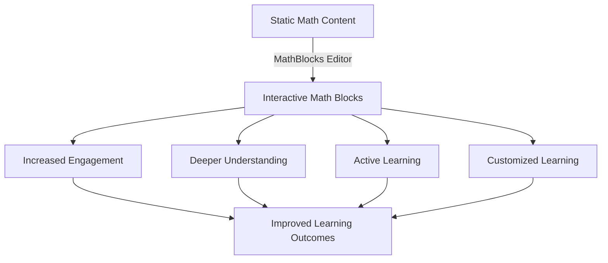

# MathBlocks Editor: Executive Summary

## Project Overview

MathBlocks Editor is a specialized web application designed to transform static HTML math content into interactive, engaging components for high school students. The system analyzes existing HTML mathematics content, identifies opportunities for interactivity, and provides tools to convert static elements into configurable, reusable interactive blocks that enhance student learning through direct manipulation and exploration.

## Value Proposition

The MathBlocks Editor transforms traditional mathematics education by:

- **Turning passive content into active learning experiences** where students directly manipulate mathematical objects and relationships
- **Converting abstract concepts into visual, interactive representations** that build intuitive understanding
- **Providing immediate feedback** that reinforces correct understanding and addresses misconceptions
- **Creating consistent, reusable interactive elements** that can be deployed across curriculum materials
- **Enabling educators** to easily enhance existing content without advanced technical skills

## Key Capabilities

### 1. Intelligent Content Analysis

The system intelligently analyzes HTML math content using:
- Pattern recognition for mathematical expressions and structures
- Semantic analysis to understand content purpose and relationships
- Structural analysis to identify potential interactive elements
- Contextual understanding of mathematical domains

### 2. Interactive Block Library

MathBlocks provides a comprehensive library of interactive block types:
- **Equation Explorer:** Manipulate variables and see real-time changes to graphs and values
- **Problem Solver:** Step through solution processes with guidance and feedback
- **Concept Visualizer:** Explore visual representations of abstract concepts
- **Formula Calculator:** Input values and see calculated results with explanations
- **Interactive Assessment:** Apply understanding with immediate feedback
- **Data Explorer:** Analyze and visualize mathematical data and relationships

### 3. Transformation Toolset

Educators can transform content through:
- Visual highlighting of transformation opportunities
- Suggested block types based on content analysis
- Parameter extraction from existing content
- Preview of interactive transformations
- Configuration tools for customizing block behavior

### 4. Export & Integration

Transformed content can be deployed through:
- Self-contained HTML/JS packages for standalone use
- LMS integration options for popular platforms
- Embedding API for integration with existing websites
- Documentation and implementation guides

## Design Philosophy

The MathBlocks Editor is built on five core principles:

1. **Pedagogically-Driven Design:** Every feature serves clear educational purposes based on research-backed principles of mathematics education.

2. **Intuitive Transformation:** Content analysis and transformation should be straightforward enough for educators without technical expertise.

3. **Flexible Implementation:** Interactive blocks should be usable across platforms and devices with minimal technical requirements.

4. **Accessibility First:** All interactive elements are designed to be accessible to all students, including those with disabilities.

5. **Continuous Improvement:** The system evolves based on usage data, educator feedback, and learning outcome analysis.

## Implementation Overview

The MathBlocks Editor development follows a phased approach:

| Phase | Focus | Timeline | Key Deliverables |
|-------|-------|----------|------------------|
| 1: Foundation | Core infrastructure and UI | Weeks 1-3 | Project setup, UI components, dashboard |
| 2: Block System | Block architecture and initial blocks | Weeks 4-6 | Block model, registry, initial block types |
| 3: Content Analysis | HTML parsing and transformation | Weeks 7-9 | Analysis engine, pattern recognition, transformation UI |
| 4: Block Expansion | Additional block types | Weeks 10-12 | Complete block library, enhanced capabilities |
| 5: Export & Integration | Deployment options | Weeks 13-15 | Export system, embedding API, documentation |
| 6: Refinement | Optimization and beta | Weeks 16-18 | Performance enhancements, beta program |

## Planning Document Guide

This executive summary is complemented by detailed planning documents:

### 1. Project Architecture

[Project Architecture](1-project-architecture.md) outlines the system's technical design including:
- Architectural overview and component relationships
- Technical stack and implementation approach
- Directory structure and code organization
- Core workflows and system interactions

### 2. Block Types Specification

[Block Types Specification](2-block-types-specification.md) details the interactive block system:
- Block data structure and properties
- Core block types and their capabilities
- Implementation requirements
- Integration and extension capabilities

### 3. Content Analysis Strategy

[Content Analysis Strategy](3-content-analysis-strategy.md) explains how the system:
- Analyzes HTML structure and content
- Identifies mathematical elements
- Maps content to appropriate block types
- Generates transformation suggestions

### 4. Implementation Roadmap

[Implementation Roadmap](4-implementation-roadmap.md) provides the development plan:
- Phased implementation approach
- Specific goals and deliverables for each phase
- Resource requirements and timeline
- Risk management strategy

### 5. Pedagogical Approach

[Pedagogical Approach](5-pedagogical-approach.md) covers the educational foundations:
- Core pedagogical principles
- Engagement strategies
- Learning impact design
- Assessment opportunities
- Accessibility considerations

## Next Steps

With this comprehensive planning in place, the next steps are:

1. **Development team assembly** with specific expertise in React, Next.js, mathematics education, and UI/UX design
2. **Initial project setup** including repository, development environment, and CI/CD pipeline
3. **Foundation phase implementation** focusing on UI components and basic dashboard
4. **Stakeholder review** of initial implementation to refine direction
5. **Iterative development** following the outlined roadmap
