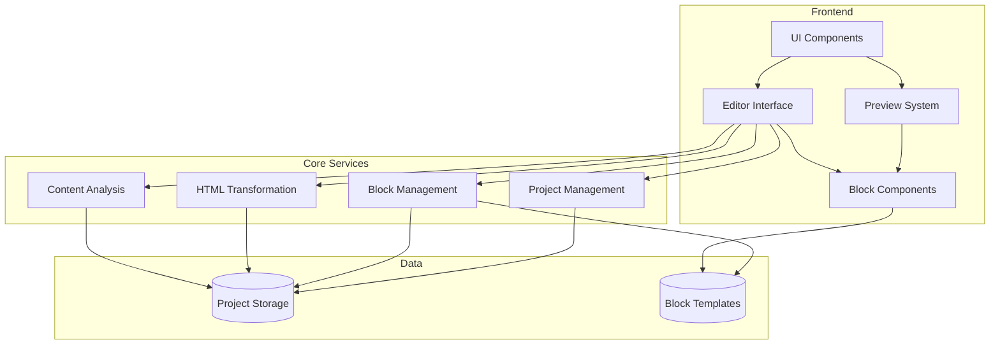
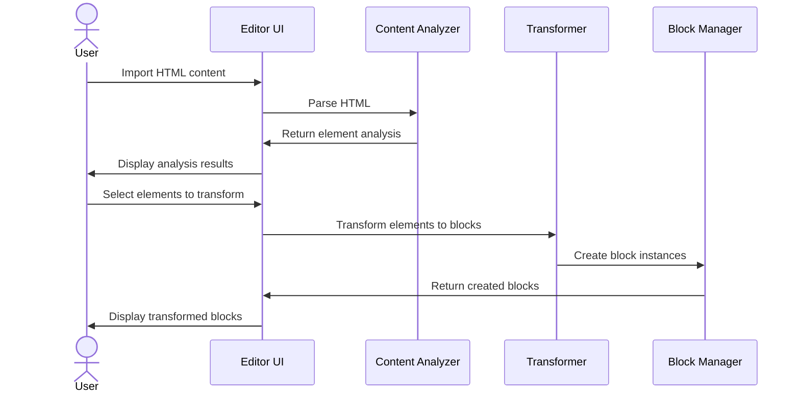
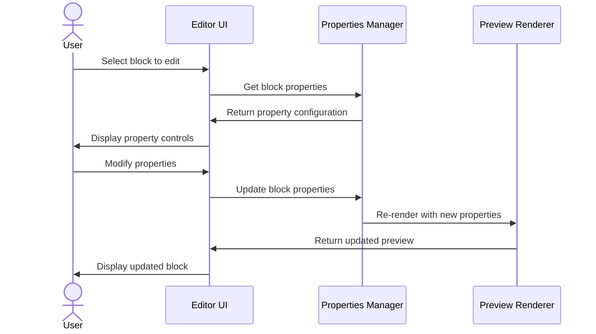

# MathBlocks Editor: Project Architecture

## Overview

MathBlocks Editor is a specialized application designed to transform static HTML math content into interactive, engaging components for high school students. The system analyzes existing HTML content, identifies potential interactive elements, and provides tools to convert them into reusable, configurable blocks.

## Architecture Diagram



## Core Subsystems

### 1. UI Layer

- **Dashboard:** Project management interface
- **Editor:** Block configuration and customization
- **Preview:** Real-time rendering of interactive blocks
- **Component Library:** UI components following design system

### 2. Core Services

- **Content Analysis:** Parses HTML to identify potential interactive elements
- **HTML Transformation:** Converts static HTML elements to interactive blocks
- **Block Management:** Handles the creation, updating, and deletion of blocks
- **Project Management:** Manages projects, files, and user settings

### 3. Data Layer

- **Project Storage:** Persists project data and configurations
- **Block Templates:** Pre-defined block types with default configurations
- **Export System:** Generates standalone HTML/JS for use in various platforms

## Technical Stack

- **Framework:** Next.js 15 with App Router
- **UI Components:** Radix UI primitives with custom styling
- **Styling:** TailwindCSS for utility-first styling
- **State Management:** React Context + Reducers for application state
- **Content Parsing:** Custom HTML parser with heuristics for math content
- **Math Rendering:** MathJax/KaTeX for equation rendering
- **Interactive Elements:** Custom React components with D3.js for visualizations

## Directory Structure

```
mathblocks-editor/
├── src/
│   ├── app/                 # Next.js App Router pages
│   ├── components/          # React components
│   │   ├── ui/              # Base UI components
│   │   ├── blocks/          # Interactive block implementations
│   │   ├── editor/          # Editor-specific components
│   │   └── wizards/         # Multi-step wizards for complex operations
│   ├── lib/                 # Core utilities and services
│   │   ├── block-templates/ # Block type definitions and defaults
│   │   ├── content-analysis/# HTML parsing and analysis
│   │   ├── transformers/    # HTML to block transformers
│   │   └── utils/           # General utility functions
│   └── public/              # Static assets
└── planning/                # Architecture and design documents
```

## Key Workflows

### Content Import and Analysis



### Block Editing and Configuration



## Security and Performance Considerations

- **Content Sandboxing:** Preview execution in isolated context
- **Input Validation:** Validate all user inputs for configuration
- **Performance Optimization:** Lazy loading of block components
- **Caching Strategy:** Cache block templates and rendered content

## Future Extensibility

- **Plugin System:** Allow for custom block types
- **API Integration:** Connect to LMS and other educational platforms
- **Collaborative Editing:** Multi-user simultaneous editing
- **Analytics Integration:** Track student interaction with blocks
