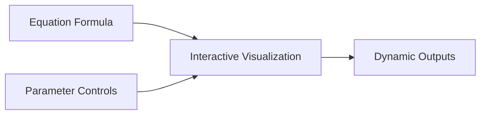
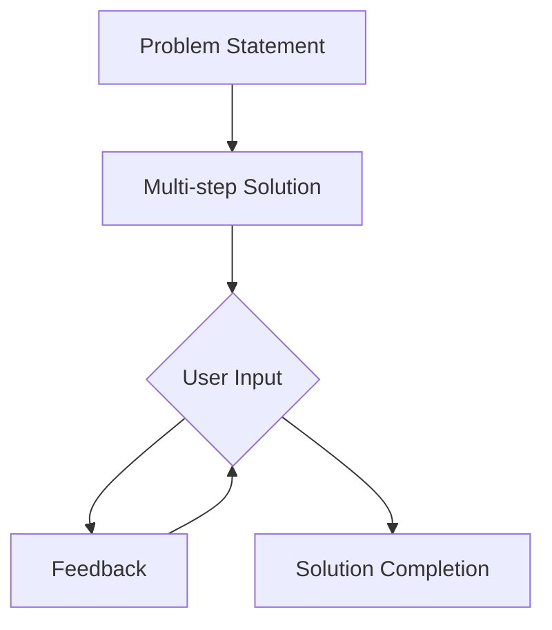
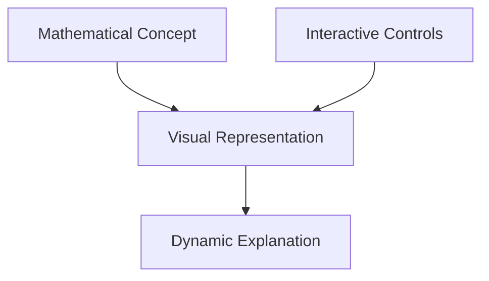
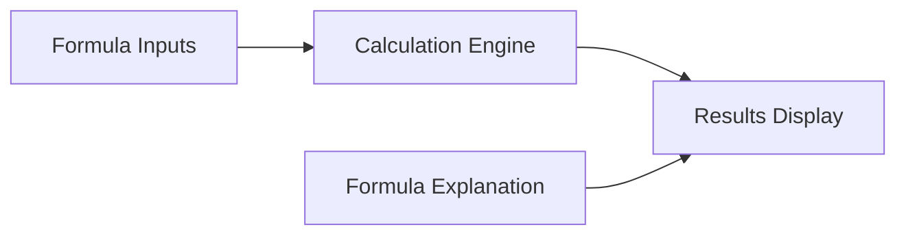
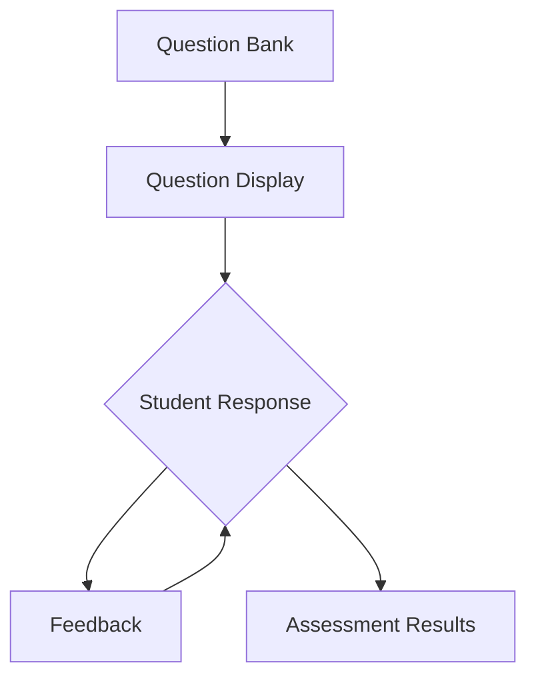
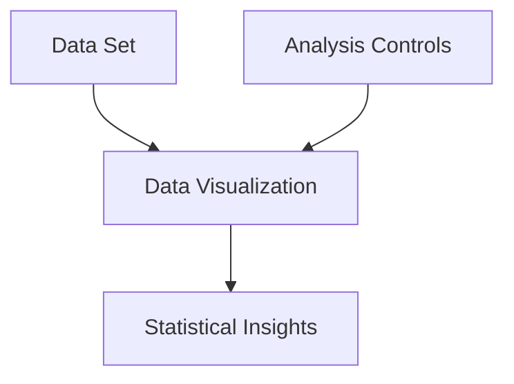

# MathBlocks Editor: Block Types Specification

## Overview

Interactive math blocks are the core components of the MathBlocks Editor system. These configurable, reusable components transform static content into engaging interactive elements that enhance student learning. This document defines the standard block types available in the system and their specifications.

## Block Structure

Each block follows a standard structure:

```json
{
  "id": "unique-block-id",
  "type": "block-type-identifier",
  "name": "Human-readable block name",
  "description": "Block description",
  "parameters": {
    // Type-specific configuration options
  },
  "content": {
    "title": "Block title shown to students",
    "description": "Instructions or context for the block",
    // Type-specific content
  },
  "metadata": {
    "createdAt": "ISO date",
    "updatedAt": "ISO date",
    "tags": ["algebra", "functions"],
    "difficulty": "basic|intermediate|advanced"
  }
}
```

## Core Block Types

### 1. Equation Explorer



**Purpose:** Allows students to manipulate equation parameters and observe the effect on graphs or outputs.

**Specifications:**
- **Type ID:** `equation-explorer`
- **Key Parameters:**
  - `equation`: String representation of the equation
  - `variables`: Array of variables that can be manipulated
  - `range`: Min/max values for each variable
  - `initialValues`: Starting values for variables
  - `showGraph`: Boolean to show/hide graph visualization
  - `showFormula`: Boolean to show/hide dynamic formula
- **Visualizations:**
  - Coordinate plane with dynamic graphing
  - Real-time equation display with parameter substitution

**Example Use Cases:**
- Linear equation exploration (slope-intercept form)
- Quadratic function visualization
- Trigonometric function behavior

### 2. Interactive Problem Solver



**Purpose:** Guides students through multi-step problem solving with interactive feedback.

**Specifications:**
- **Type ID:** `problem-solver`
- **Key Parameters:**
  - `problemType`: Type of problem (algebraic, geometric, etc.)
  - `difficulty`: Complexity level
  - `stepsVisible`: Which steps to show vs. require input
  - `feedbackLevel`: Detail level of feedback
  - `solutionHints`: Available hints configuration
- **Interaction Modes:**
  - Step-by-step solution entry
  - Guided solution with hints
  - Multiple solution paths

**Example Use Cases:**
- Algebraic equation solving
- Word problem step-by-step solutions
- Geometry proof assistance

### 3. Concept Visualizer



**Purpose:** Visually demonstrates mathematical concepts with interactive elements.

**Specifications:**
- **Type ID:** `concept-visualizer`
- **Key Parameters:**
  - `conceptType`: Mathematical concept category
  - `interactiveElements`: Configurable interactive parts
  - `animationSpeed`: Control for demonstrations
  - `detailLevel`: Complexity of visual elements
  - `annotations`: Text labels and explanation visibility
- **Visualization Types:**
  - Animated demonstrations
  - Interactive diagrams
  - Step-through concept explanations

**Example Use Cases:**
- Pythagorean theorem visual proof
- Geometric transformations
- Function domain and range visualization

### 4. Formula Calculator



**Purpose:** Allows students to input values into formulas and see calculated results with explanation.

**Specifications:**
- **Type ID:** `formula-calculator`
- **Key Parameters:**
  - `formula`: Mathematical formula to calculate
  - `inputs`: Configurable input fields
  - `validationRules`: Input constraints
  - `precisionLevel`: Decimal precision
  - `showSteps`: Boolean to show calculation steps
- **Features:**
  - Dynamic calculation
  - Step-by-step computation display
  - Unit conversion support

**Example Use Cases:**
- Geometric area/volume calculations
- Physics formula calculations
- Statistical calculations

### 5. Interactive Assessment



**Purpose:** Provides interactive question types with immediate feedback.

**Specifications:**
- **Type ID:** `interactive-assessment`
- **Key Parameters:**
  - `questionType`: Multiple choice, fill-in, drag-drop, etc.
  - `difficulty`: Question difficulty level
  - `attemptLimit`: Max number of tries
  - `scoringMethod`: How answers are scored
  - `feedbackType`: Immediate or delayed feedback
- **Question Types:**
  - Multiple choice
  - Numeric entry
  - Expression matching
  - Drag and drop

**Example Use Cases:**
- Concept check questions
- Practice problem sets
- Self-assessment quizzes

### 6. Mathematical Data Explorer



**Purpose:** Allows students to analyze and visualize mathematical data.

**Specifications:**
- **Type ID:** `data-explorer`
- **Key Parameters:**
  - `dataSet`: Input data array or generation parameters
  - `visualizationType`: Chart/graph types
  - `analysisTools`: Available statistical tools
  - `interactiveFeatures`: Sorting, filtering, etc.
  - `annotationOptions`: Highlighting/marking features
- **Visualization Types:**
  - Scatter plots
  - Line graphs
  - Histograms
  - Box plots

**Example Use Cases:**
- Statistical data analysis
- Function data exploration
- Pattern recognition

## Block Implementation Requirements

### Rendering Layer

- Each block must provide both a configuration interface and a runtime rendering component
- Blocks must be responsive and function on both desktop and mobile devices
- Accessibility requirements must be met (keyboard navigation, screen reader support, etc.)

### State Management

- Blocks must maintain internal state for interactive elements
- State changes should trigger appropriate visual updates
- Session persistence may be required for complex blocks

### Extensibility

- Block implementations should follow a plugin architecture
- Custom block types should be able to extend base block types
- Block configurations should be serializable and portable

## Integration Capabilities

### Export Formats

- **HTML/JavaScript:** Self-contained interactive elements
- **Learning Management System:** LTI-compatible packages
- **Embeddable Widgets:** iFrame or script embedding

### API Requirements

- **Content Transformation API:** Convert static content to block definitions
- **Block Registry API:** Register and discover available block types
- **Rendering API:** Load and display blocks in various contexts

## Development Guidelines

- Use React functional components with hooks for block implementation
- Implement configurable theming support
- Ensure each block has appropriate testing (unit tests, integration tests)
- Performance optimization for blocks with complex visualizations
- Document block API and configuration options thoroughly
