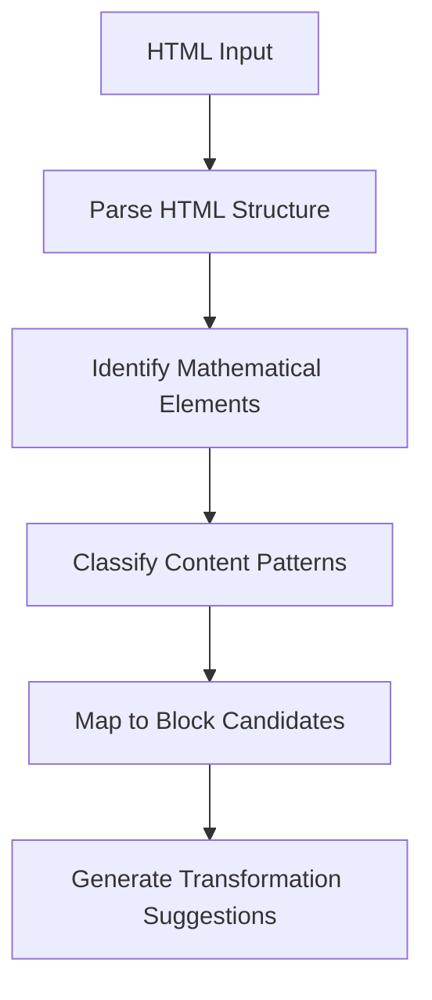

# MathBlocks Editor: Content Analysis Strategy

## Overview

The Content Analysis system is a core component of the MathBlocks Editor, responsible for intelligently analyzing static HTML math content and identifying opportunities for transformation into interactive blocks. This document outlines the strategy and techniques used to parse, analyze, and prepare HTML content for conversion.

## Content Analysis Pipeline

## Analysis Components

### 1. HTML Structure Parser

**Purpose:** Analyze the document structure to understand content organization and semantic meanings.

**Techniques:**
- DOM traversal to create a hierarchical representation
- Semantic analysis of HTML elements (headings, sections, divs, etc.)
- Extraction of class and ID patterns that indicate content types
- Identification of content grouping patterns

**Outputs:**
- Document tree with semantic annotations
- Content section boundaries
- Heading hierarchy and relationship mapping

### 2. Mathematical Content Detector

**Purpose:** Identify and classify mathematical content within the HTML.

**Detection Methods:**
- **Formula Detection:**
  - MathJax/KaTeX markup identification
  - Inline equation pattern recognition
  - ASCII math notation detection
  
- **Numerical Data Detection:**
  - Table data analysis
  - Numerical pattern recognition in text
  - Unit and measurement identification
  
- **Visual Element Analysis:**
  - Graph and chart identification
  - Coordinate system detection
  - Geometric shape recognition

**Classification:**
- Algebraic expressions and equations
- Geometric content
- Statistical data
- Calculus concepts
- Function definitions and graphs

### 3. Interactive Potential Analyzer

**Purpose:** Evaluate content for interactive transformation opportunities.

**Analysis Factors:**
- Content complexity and depth
- Student engagement potential
- Learning objective alignment
- Technical feasibility for transformation

**Scoring System:**
- Interactive potential score (1-10)
- Transformation complexity rating
- Student benefit estimation
- Recommended block type mapping

### 4. Pattern Recognition Engine

**Purpose:** Identify recurring patterns in content that suggest standardized transformations.

**Pattern Types:**
- **Conceptual Patterns:**
  - Definition-example-practice sequence
  - Step-by-step solution demonstrations
  - Theory-application patterns
  
- **Structural Patterns:**
  - Question-answer pairs
  - Multi-step problems
  - Example sets with variations

**Pattern Matching:**
- Template-based pattern matching
- Machine learning classification models
- Heuristic rule-based detection

### 5. Block Mapping Engine

**Purpose:** Map identified content to appropriate block types based on analysis.

**Mapping Process:**
- Content type analysis
- Interactive potential assessment
- Block capability matching
- Parameter extraction for configuration

**Output:**
- Recommended block type
- Required and optional parameters
- Content transformation plan
- Confidence score for recommendation

## Analysis Techniques

### Heuristic Rules

The system employs a set of heuristic rules to identify mathematical content types:

| Content Pattern | Recognition Rule | Block Type Mapping |
|----------------|------------------|-------------------|
| y = mx + b format | `/y\s*=\s*([a-z])\s*x\s*[+\-]\s*([0-9]+)/` | Equation Explorer (Linear) |
| ax² + bx + c format | `/([a-z])\s*x\s*\^\s*2\s*[+\-]\s*([a-z])\s*x\s*[+\-]\s*([0-9]+)/` | Equation Explorer (Quadratic) |
| Step-by-step solution | Sequential numbered/bullet steps with calculations | Interactive Problem Solver |
| Data table with numerical values | `<table>` with primarily numeric cells | Mathematical Data Explorer |
| Multiple choice question | Question text followed by lettered/numbered options | Interactive Assessment |
| Geometric diagram with measurements | SVG/image with geometric shapes and measurement text | Concept Visualizer |

### Natural Language Processing

For text-heavy content, NLP techniques help identify mathematical concepts:

- **Keyword Extraction:** Identify mathematical terms and concepts
- **Intent Classification:** Determine educational purpose (instruction, example, practice)
- **Entity Recognition:** Extract mathematical entities (variables, equations, etc.)

### Visual Element Analysis

For graphical content:

- **Image Classification:** Identify charts, graphs, and diagrams
- **Structural Analysis:** Detect coordinate systems, function plots, etc.
- **Text-in-Image Extraction:** Capture equation text from images when possible

## Transformation Planning

### Transformation Suggestions Generation

After analysis, the system generates transformation suggestions including:

1. **Block Type Recommendation:** Primary and alternative block types
2. **Parameter Extraction:** Proposed configuration values from content
3. **Content Segmentation:** How to divide content for transformation
4. **Interactive Elements:** Recommended interactive controls
5. **Visualization Approach:** How to represent visual elements

### Confidence Scoring

Each suggestion includes confidence metrics:

- **Match Confidence:** How certain the system is about the pattern match
- **Transformation Complexity:** Estimated effort for transformation
- **Interactive Potential:** Estimated value of interactivity
- **Content Coverage:** How much of the original content is utilized

## Implementation Considerations

### Performance Optimization

- Implement progressive analysis for large documents
- Use web workers for background processing
- Cache analysis results for repeated sections

### Extensibility

- Plugin architecture for custom detectors
- Configurable rule sets for different content types
- Trainable classification models for specific domains

### Accuracy Improvement

- User feedback integration to improve recommendations
- Pattern library expansion based on content repository
- Continuous training of classification models

## User Experience Integration

### Analysis Results Presentation

- Visual highlighting of transformation opportunities in content
- Side-by-side preview of original vs. transformed content
- Confidence indicators for recommendations
- Interactive selection of elements for transformation

### User Guidance

- Transformation wizards for complex content
- Adaptive recommendations based on user preferences
- Progressive disclosure of transformation options

## Future Enhancements

- **AI-Assisted Analysis:** Deep learning models for complex pattern recognition
- **Cross-Document Learning:** Learn patterns across multiple documents
- **Custom Pattern Training:** Allow users to train custom pattern recognition
- **Automatic Block Generation:** Direct generation of block configurations
- **Learning Objective Alignment:** Map content to educational standards
