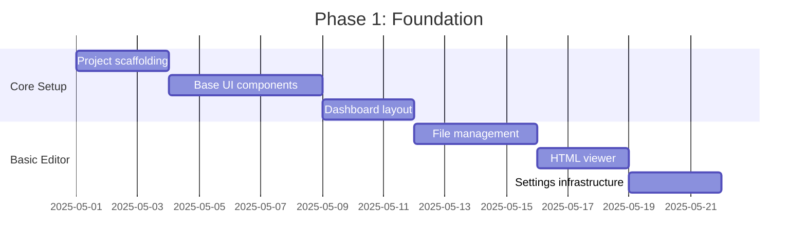
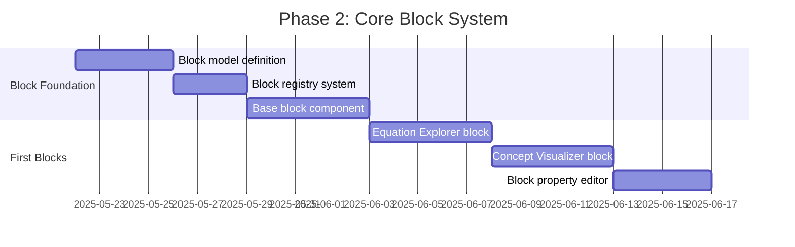
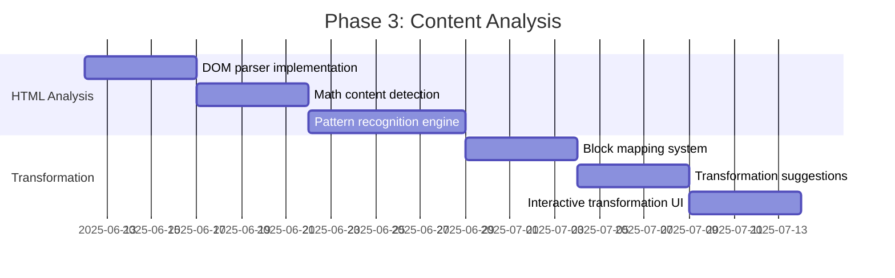
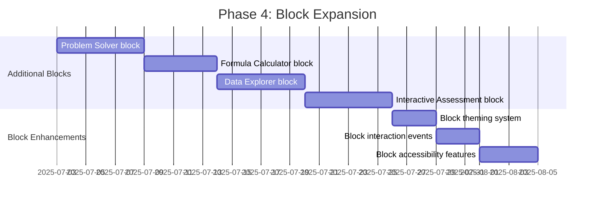
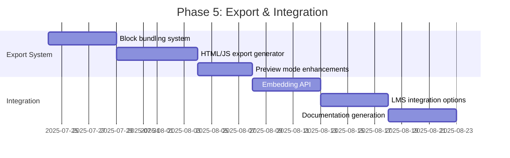
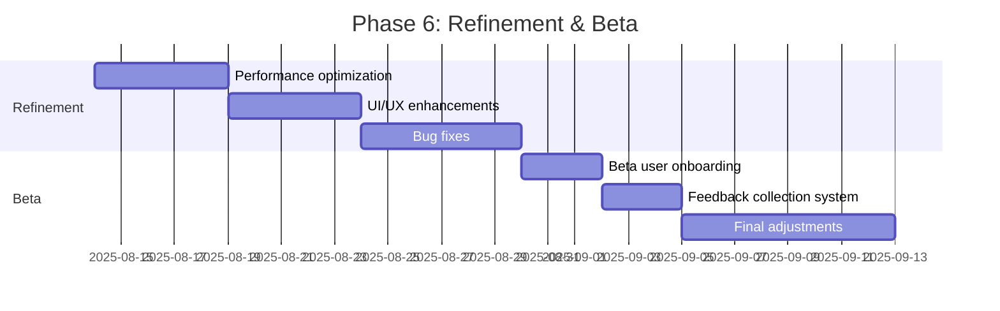

# MathBlocks Editor: Implementation Roadmap

## Overview

This document outlines the phased implementation plan for developing the MathBlocks Editor. The development process is structured in iterative phases, each building on the previous one to deliver a progressively more capable system.

## Phase 1: Foundation (Weeks 1-3)

### Goals
- Establish project structure and development workflow
- Create foundational UI components using Radix UI
- Implement basic dashboard and project management
- Set up file management system for HTML content

### Key Deliverables
1. **Project Setup**
   - Next.js application with TypeScript configuration
   - TailwindCSS integration
   - Component architecture design
   - Folder structure following architectural plan

2. **UI Foundation**
   - Core UI component library (buttons, dialogs, tabs, etc.)
   - Responsive layout system
   - Theming infrastructure
   
3. **Dashboard UI**
   - Project listing interface
   - Project creation workflow
   - HTML file import functionality
   
4. **Basic Project Editor**
   - File browser component
   - HTML content viewer
   - Basic settings panel

### Technical Focus
- Establish coding standards and patterns
- Set up testing infrastructure
- Create documentation templates
- Implement state management foundations

## Phase 2: Core Block System (Weeks 4-6)

### Goals
- Implement the core block system architecture
- Develop block management infrastructure
- Create first interactive block implementations
- Build block configuration interface

### Key Deliverables
1. **Block System**
   - Block data model implementation
   - Block type registry
   - Block serialization/deserialization
   - Block rendering system
   
2. **Initial Block Types**
   - Equation Explorer (linear & quadratic)
   - Concept Visualizer (basic)
   - Integration with math rendering libraries
   
3. **Block Management**
   - Block property editor
   - Block preview system
   - Block validation framework

### Technical Focus
- Reusable block component architecture
- State management for interactive blocks
- Dynamic property form generation
- Integration of math libraries (KaTeX/MathJax)

## Phase 3: Content Analysis (Weeks 7-9)

### Goals
- Implement HTML content analysis system
- Develop pattern recognition for mathematical content
- Create transformation suggestion engine
- Build interactive UI for content transformation

### Key Deliverables
1. **HTML Analysis Engine**
   - DOM traversal and analysis
   - Mathematical content detection
   - Pattern recognition for block mapping
   
2. **Transformation Engine**
   - Content to block mapping algorithm
   - Parameter extraction from content
   - Transformation plan generation
   
3. **Transformation UI**
   - Content analysis visualization
   - Transformation suggestion interface
   - Interactive selection of elements
   - Transformation preview

### Technical Focus
- Efficient DOM processing
- Pattern matching algorithms
- Heuristic rule implementation
- Interactive highlighting and selection

## Phase 4: Block Expansion (Weeks 10-12)

### Goals
- Expand available block types
- Enhance block capabilities and features
- Implement advanced visualization components
- Improve block customization options

### Key Deliverables
1. **Additional Block Types**
   - Problem Solver with step-by-step solutions
   - Formula Calculator with dynamic inputs
   - Data Explorer with charting capabilities
   - Interactive Assessment with feedback
   
2. **Block Enhancements**
   - Customizable theming for blocks
   - Inter-block communication
   - Accessibility improvements
   - Advanced configuration options

### Technical Focus
- Reusable math visualization components
- Step-based interaction patterns
- Data visualization libraries integration
- Accessibility compliance

## Phase 5: Export & Integration (Weeks 13-15)

### Goals
- Implement export system for interactive content
- Create standalone HTML/JS package generator
- Develop integration options for various platforms
- Generate comprehensive documentation

### Key Deliverables
1. **Export System**
   - Self-contained HTML/JS generation
   - Asset bundling for exports
   - Export configuration options
   
2. **Integration API**
   - Embedding API for blocks
   - LMS integration connectors
   - External platform compatibility
   
3. **Documentation & Examples**
   - User documentation
   - Developer API documentation
   - Example project gallery
   - Block usage examples

### Technical Focus
- JavaScript bundling and optimization
- Cross-platform compatibility
- Documentation generation
- Integration testing

## Phase 6: Refinement & Beta (Weeks 16-18)

### Goals
- Optimize performance across the application
- Enhance overall UI/UX based on testing
- Fix identified bugs and issues
- Launch beta program and gather feedback

### Key Deliverables
1. **System Optimization**
   - Performance profiling and improvements
   - Load time optimization
   - Memory usage optimization
   
2. **User Experience Refinement**
   - UI polish and consistency
   - Workflow improvements
   - Responsive design enhancements
   
3. **Beta Program**
   - Beta documentation
   - Feedback collection system
   - Issue tracking and resolution
   - Final adjustments based on feedback

### Technical Focus
- Performance profiling and optimization
- Cross-browser testing
- Accessibility testing
- User feedback integration

## Resource Requirements

### Development Team
- **Frontend Engineers** (2-3): React, Next.js, TypeScript expertise
- **UI/UX Designer** (1): Interface design, interaction design
- **Mathematics SME** (1): Subject matter expert for content and block design
- **QA Engineer** (1): Testing and quality assurance

### Tools & Technologies
- **Development**: Next.js, TypeScript, TailwindCSS, Radix UI
- **Mathematics**: KaTeX/MathJax, D3.js, math computation libraries
- **Testing**: Jest, React Testing Library, Playwright
- **Deployment**: Vercel/Netlify, GitHub Actions

## Risk Management

| Risk | Impact | Likelihood | Mitigation |
|------|--------|------------|------------|
| Complex mathematical rendering performance | High | Medium | Implement progressive rendering, optimize math libraries usage |
| Browser compatibility for interactive elements | Medium | Medium | Establish browser support matrix, implement graceful degradation |
| Content analysis accuracy | High | High | Iterative improvement of algorithms, fallback to manual assistance |
| Export compatibility with various platforms | Medium | Medium | Focus on standards compliance, targeted testing with major platforms |
| Scope creep in block functionality | Medium | High | Maintain strict prioritization, implement phased approach to features |

## Success Metrics

- **System Performance**: 
  - Page load under 2 seconds
  - Block rendering under 500ms
  - Smooth interactions (60fps)

- **Content Analysis**:
  - 80%+ accuracy in identifying mathematical content
  - 70%+ relevant transformation suggestions

- **User Experience**:
  - < 5 steps for complete content transformation
  - < 2 minutes to create first interactive block
  - Positive usability scores from beta testing

## Post-Launch Considerations

- **Analytics Integration**: Tracking usage patterns and block effectiveness
- **Community Building**: User forums and knowledge sharing
- **Continuous Improvement**: Feature request prioritization system
- **Extension Marketplace**: Platform for third-party block types
- **Educational Integration**: Deeper LMS and educational platform connections
