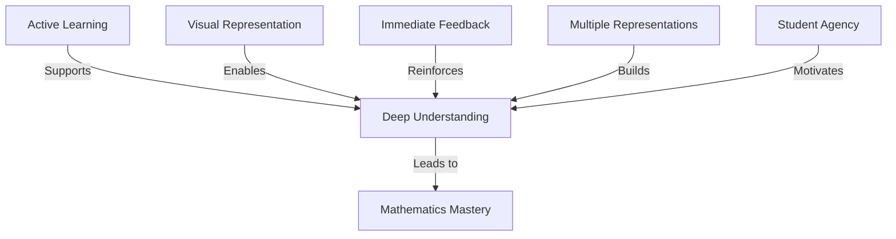
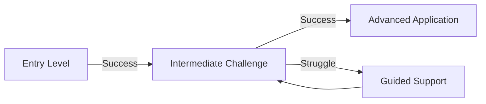

# MathBlocks Editor: Pedagogical Approach & Student Engagement

## Overview

The MathBlocks Editor is designed not just as a technical tool, but as an educational platform that enhances mathematics learning through interactive engagement. This document outlines the pedagogical principles, engagement strategies, and learning impact considerations that guide the development of the system.

## Core Pedagogical Principles

### Active Learning

Interactive blocks transform passive content consumption into active learning experiences, where students:

- **Manipulate parameters** to see dynamic outcomes
- **Test hypotheses** about mathematical relationships
- **Explore boundaries** of concepts through direct interaction
- **Construct knowledge** through guided discovery

### Visual Representation

Mathematical concepts become more accessible through:

- **Dynamic visualization** of abstract concepts
- **Multiple representations** (symbolic, graphical, numerical)
- **Animated transitions** that highlight relationships
- **Visual patterns** that reveal mathematical structures

### Immediate Feedback

Learning is reinforced through:

- **Real-time responses** to student interactions
- **Guided error correction** with helpful feedback
- **Progressive hint systems** that support without solving
- **Visual confirmation** of correct understanding

### Multiple Approaches

Diverse learning styles are accommodated through:

- **Varied interaction models** for different learners
- **Multiple solution paths** for problem-solving
- **Differentiated complexity levels** within blocks
- **Complementary representations** of the same concept

### Student Agency

Engagement is enhanced by giving students control over:

- **Exploration pace** tailored to individual needs
- **Learning pathway** choices within guided frameworks
- **Difficulty adjustment** based on confidence level
- **Personal connection** through relevant examples

## Learning Impact Design

Each block type is designed with specific learning impacts in mind:

| Block Type | Learning Impact | Assessment Opportunity |
|------------|----------------|------------------------|
| Equation Explorer | Builds intuitive understanding of relationships between variables | Observe how students manipulate variables to achieve specific outcomes |
| Interactive Problem Solver | Develops systematic problem-solving strategies | Track solution approaches and common misconception points |
| Concept Visualizer | Connects abstract concepts to visual representations | Assess comprehension through interaction patterns |
| Formula Calculator | Reinforces relationships between inputs and outputs | Monitor which variables students experiment with most |
| Interactive Assessment | Provides immediate application of concepts | Collect direct performance metrics on concept mastery |
| Data Explorer | Builds data literacy and pattern recognition | Observe analytical approaches and conclusions drawn |

## Engagement Strategies

### 1. Progressive Challenge

- **Scaffolded complexity** that increases as students demonstrate mastery
- **Challenge zones** calibrated to student ability level
- **Optional extensions** for students ready for deeper exploration
- **Skill-building progression** with clear learning pathways

### 2. Meaningful Context

- **Real-world applications** that demonstrate relevance
- **Narrative elements** that create engagement through story
- **Student-relevant scenarios** customized to interests
- **Cross-disciplinary connections** to other subject areas

### 3. Productive Failure

- **Safe exploration environments** where mistakes are learning opportunities
- **Guided discovery** that allows students to recognize patterns through trial and error
- **Strategic hints** that appear after multiple unsuccessful attempts
- **Solution path visualization** to compare approaches

### 4. Social Learning

- **Result sharing** capabilities for classroom discussion
- **Collaborative problem-solving** opportunities
- **Teacher demonstration mode** for guided instruction
- **Peer comparison** of different solution approaches

### 5. Achievement Recognition

- **Progress tracking** showing concept mastery development
- **Milestone achievements** for completing learning sequences
- **Mastery indicators** showing depth of understanding
- **Challenge completion** recognition for advanced applications

## Pedagogical Design Guidelines for Block Creation

### Content Design Principles

1. **Clarity of Learning Objective**
   - Each block should have a clear, specific learning objective
   - Interactions should directly support the learning goal
   - Success criteria should be transparent to students

2. **Conceptual Focus**
   - Prioritize conceptual understanding over procedural fluency
   - Highlight key relationships and principles
   - Connect to foundational mathematical ideas

3. **Cognitive Load Management**
   - Focus attention on the most important elements
   - Scaffold complexity through progressive disclosure
   - Minimize extraneous details that distract from core concepts

### Interaction Design Principles

1. **Purposeful Interaction**
   - Every interactive element should have pedagogical purpose
   - Interactions should reveal mathematical relationships
   - Input constraints should focus exploration on key concepts

2. **Guidance Calibration**
   - Balance exploration with appropriate guidance
   - Provide just-in-time support when needed
   - Fade scaffolding as student understanding develops

3. **Feedback Design**
   - Make feedback specific and actionable
   - Connect feedback to underlying mathematical principles
   - Use feedback to address common misconceptions

## Accessibility Considerations

### Universal Design for Learning

The system implements Universal Design for Learning principles through:

1. **Multiple Means of Representation**
   - Visual, symbolic, and numerical representations
   - Adjustable display options for diverse needs
   - Alternative text descriptions of visual elements

2. **Multiple Means of Action and Expression**
   - Various input methods (mouse, keyboard, touch)
   - Different ways to demonstrate understanding
   - Adjustable timing and response requirements

3. **Multiple Means of Engagement**
   - Different entry points based on interest
   - Varied challenge levels for different learners
   - Options for self-regulation and reflection

### Specific Accommodations

- **Screen reader compatibility** for all interactive elements
- **Keyboard navigation** throughout the system
- **Color contrast options** for visual accessibility
- **Reduced motion settings** for students with sensory sensitivities
- **Text-to-speech integration** for mathematical expressions

## Assessment Opportunities

### Formative Assessment

Interactive blocks provide rich opportunities for formative assessment through:

- **Interaction analytics** revealing student thinking processes
- **Common error tracking** identifying misconception patterns
- **Time-on-task metrics** showing engagement and difficulty levels
- **Attempt patterns** revealing persistence and problem-solving approaches

### Competency Demonstrations

Blocks can be designed to demonstrate specific competencies:

- **Conceptual understanding** through explanation and prediction tasks
- **Procedural fluency** through multi-step problem solving
- **Strategic competence** through approach selection tasks
- **Adaptive reasoning** through justification activities
- **Productive disposition** through persistence and engagement metrics

## Teacher Tools and Support

### Classroom Implementation

- **Lesson integration guides** for each block type
- **Differentiation suggestions** for diverse learners
- **Discussion prompts** to extend digital learning
- **Classroom activity sequences** building on block interactions

### Assessment Tools

- **Student interaction dashboards** showing class patterns
- **Misconception identification** tools highlighting needs
- **Progress monitoring** across mathematical domains
- **Evidence collection** for competency demonstration

## Research-Based Foundations

The pedagogical approach is grounded in established research:

- **Constructivist learning theory** (Piaget, Vygotsky)
- **Embodied cognition** principles for mathematics
- **Cognitive load theory** for instructional design
- **Zone of proximal development** for challenge calibration
- **Growth mindset research** for productive struggle design

## Evaluation Framework

### Impact Metrics

Success of the blocks as learning tools can be measured through:

- **Conceptual understanding growth** on pre/post assessments
- **Engagement metrics** compared to traditional content
- **Persistence measures** on challenging problems
- **Transfer ability** to related mathematical contexts
- **Student self-efficacy** in mathematical domains

### Continuous Improvement

The system is designed for iterative improvement through:

- **Usage pattern analysis** to identify effective block designs
- **A/B testing** of different interaction approaches
- **Student feedback integration** for learner-centered refinement
- **Teacher input channels** for classroom implementation insights
- **Learning outcome correlation** with block design elements
